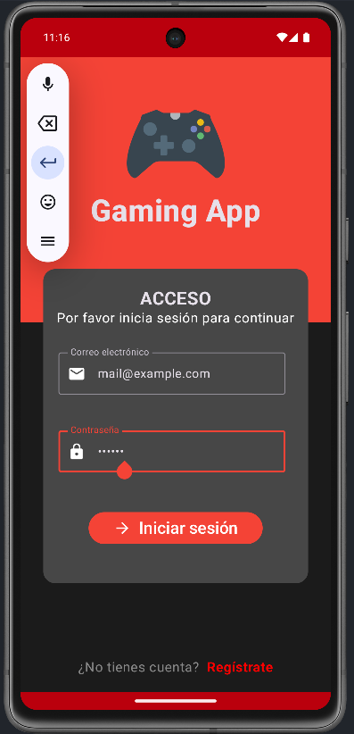
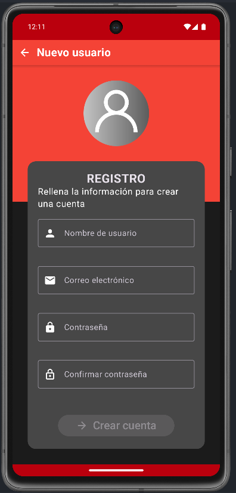
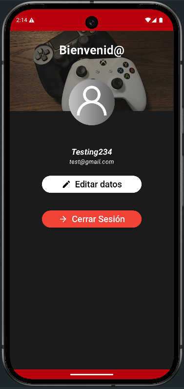
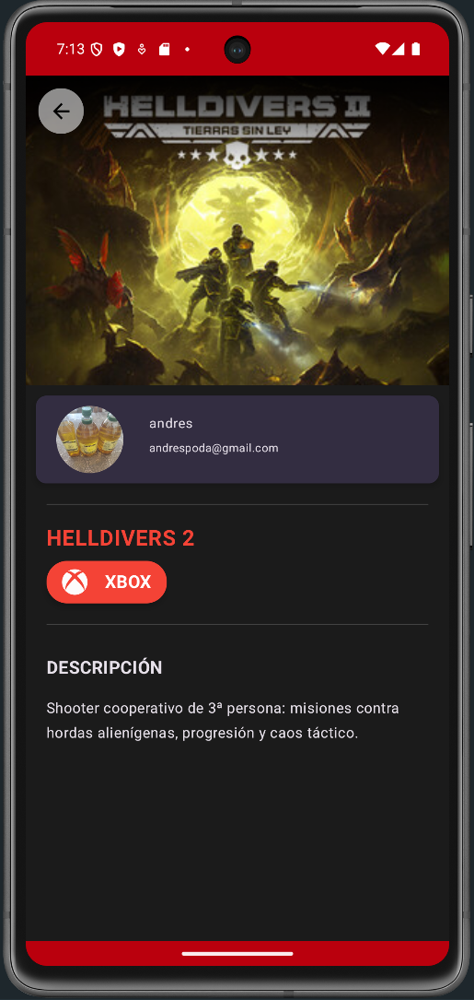
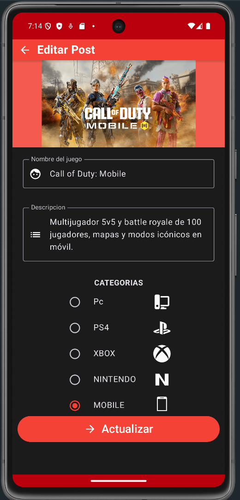

# Gaming App

## App construida en Android Studio usando Kotlin y Jetpack Compose
Esta aplicación permite a los usuarios registrarse, iniciar sesión y gestionar su perfil. Los usuarios pueden ver una lista de juegos, añadir nuevos juegos, editar detalles de juegos existentes y eliminar juegos. La aplicación utiliza Firebase para la autenticación y Firestore para el almacenamiento de datos. Permite a los usuarios gestionar su colección de juegos de manera sencilla y eficiente, además de ofrecer una interfaz moderna y atractiva.

## Funcionalidades
- Registro e inicio de sesión de usuarios
- Autenticación integrada con Firebase y Firestore
- Gestión de perfiles de usuario
- Visualización y edición de juegos
- Datos almacenados en Firestore
- Interfaz de usuario moderna con Jetpack Compose
- Navegación entre pantallas
- Validación de formularios
- Dar de alta, modificar y eliminar juegos

## Imágenes

  
  

  
  

  
  

## Tecnologías Utilizadas
- Kotlin
- Jetpack Compose
- Firebase Authentication
- Firebase Firestore
- Android Studio
- MVVM Architecture
- Clean Architecture
- Hilt para inyección de dependencias
- Coroutines para programación asíncrona
- Navigation Component para la navegación entre pantallas
- LiveData y StateFlow para la gestión del estado
- SharedPreferences para almacenamiento local

## Licencia
Este proyecto está licenciado bajo la Licencia MIT. Consulta el archivo LICENSE para más detalles.
